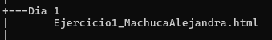

# HTML Y CSS

Realización de trabajos asignados.

# Descripción

Este repositorio consta de varias carpetas que están nombradas con los trabajos realizados por días.

# Tecnologías utilizadas

- >HTML5
- >CSS
- >Tipos de letras
- >Imágenes

# Estructura del proyecto

 
 
 

>Aquí podrás observar el código y lo utilizado para llevar a cabo la maquetación de los trabajos asignados en clase. Como podrás observar tenemos 12 carpetas las cuales contienen archivos [index.html], [style.css], también podrás observar un [readme.md], siguiente a esto tenemos las carpetas de imagenes y font las cuales contienes las imágenes y tipos de letra.

# Características
| Nombre        |Descripción |
|--|--|
| Archivos [index.html] | Estos contienen el código principal. |
| Archivos [style.css] | Estos nos permiten realizar el diseño de las páginas. |
| Archivo [readme] | El cual contiene toda la información importante realizada en el código y CSS. |
| Carpeta [imagenes]: | Esta carpeta contiene las imágenes utilizadas en todas las carpetas del repositorio. |
| Carpetas [font] | Son las que tienen los tres tipos de letra utilizadas en la página web. | 

# Diseño

- Este diseño es responsive utilizando las unidades (viewport width), (viewport height) el cual fue utilizado en todas las páginas.

- Se utilizó posicionamiento absoluto y relativo para la mayoría de los elementos.

- Se crearon menús desplegables, animaciones para la mayoría de los elementos, también se creó un acordeón.

# Instrucciones

1. >Clonar el repositorio cargado en GitHub.

2. >Abrir en la nube el archivo index.html en un navegador web.

# Desarrollado por:

Este trabajo fue desarrollado por Alejandra Machuca Molina estudiante de CampusLands.